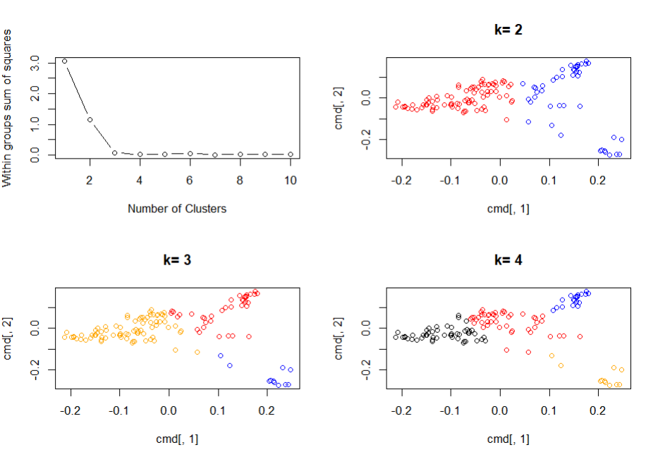
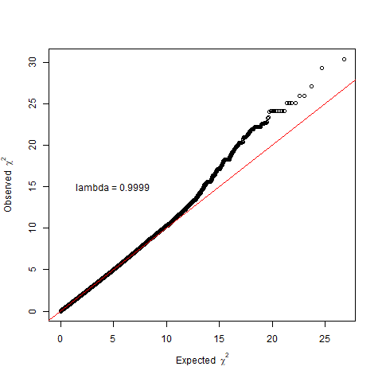
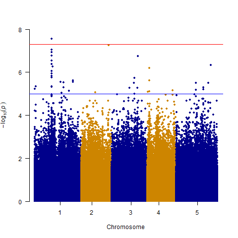
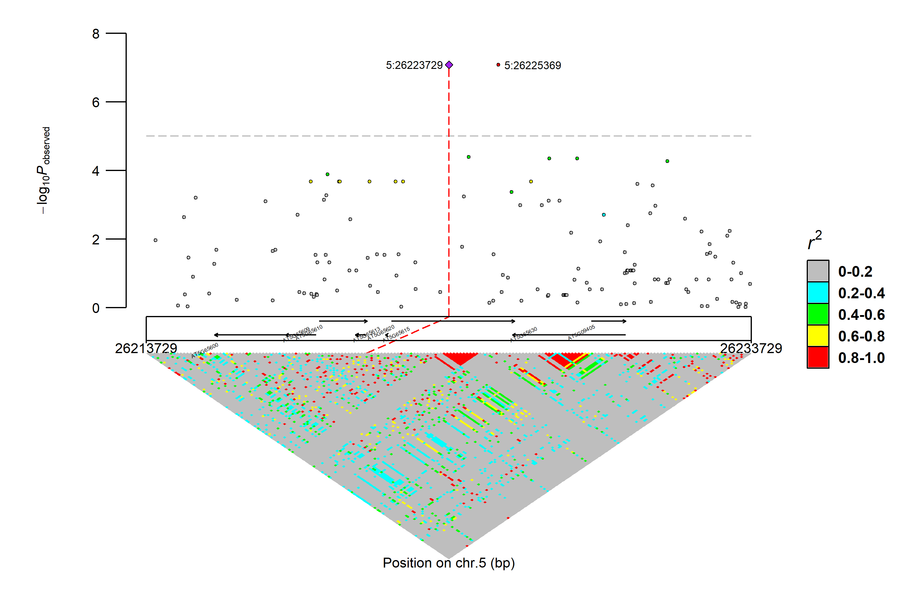

# GWAs
This repo is a simple fast GWAs pipeline.
## Table of contents
[Dependencies](#1)

[Input data description](#2)

[Add phenotype to Genabel data](#3)

[Population structure](#4)

[Heritability](#5)

[GWAs and visualization](#6)

[Locuszoom](#7)

[Variance component](#9)

[Parallel in R](#8)


## <h2 id="1">Dependencies</h2>
Code can be run on win, and also can be run on linux by changing the file path and software to linux form.
### R(3.6<version<4.0)
    packages
    - **GenABEL** for quality control and finding population structure.
    - qqman for drawing the manhattan plot.
    - IntAssoPlot for draw locuszoom plot.
    - parallel for multiple thread calculation.
### Softwares
<font color=gray>These softwares all can do GWAs independently.</font>
#### [PLINK](https://www.cog-genomics.org/plink/)
Convert GenABEL form data to binary form data.
#### [GCTA](https://yanglab.westlake.edu.cn/software/gcta/#fastGWA)
Use a fast MLM-based Genome-Wide Association method to do GWAs.
#### [TASSEL](https://tassel.bitbucket.io/)
Convert data vcf file to diplo-hmm file.

## <h2 id ="2">Input data description</h2>
### gwwa.data-class
In [**GenABEL-package**](https://github.com/HanYu-me/GWAs/blob/main/GenABEL-tutorial.pdf), a special data class, gwaa.data-class is used to store GWA data. You may consider an object of gwaa.data-class as a ’black box’ from which
you can get specific data using specific functions.
### Phenotype data
 You must have a file containing these information separated by tabs organized as such:
 ```txt
 id     phe1    phe2
 1001   100     122
 1002   101     125
 ...    ...     ...

 ```
 Where the id must be the same as gwaa.data-class individual.

## <h2 id="3">Add phenotype to Genabel data</h2>
Use GenABEL function `add.phdata()` to add phenotype value into data.
## <h2 id="4">Population structure</h2>
Population structure was described as cmd distance.
```R
ibs_m=ibs(fl.data.merge,weight="freq")
dis_m=as.dist(0.5-ibs_m)
cmd=cmdscale(dis_m)
```
And use k-means cluster method can drop outlier
```R
#choose best k
wss <- (nrow(cmd)-1)*sum(apply(cmd,2,var))
for(i in 2:10){
  wss[i]=kmeans(cmd,centers=i)$withinss  
}
plot(1:10, wss, type="b", xlab="Number of Clusters",ylab="Within groups sum of squares")
```

## <h2 id="5">Heritability</h2>
Use GCTA to calculate narrow sense heritability：
```R
GCTA_estKin <- function(gcta,output,input){
  cmd_k <- paste(gcta,"--bfile",input, "--make-grm" ,"--make-grm-alg 1","--out",output,sep=" ")
  system(cmd_k)
}
#fun for heritability
GCTA_REML <- function(t1,output,gcta,phenotype,grm){
  cmd_biGREML <- paste(gcta,"--pheno",phenotype,"--grm",grm,"--reml","--mpheno",t1, "--out",output,sep=" ")
  cat(cmd_biGREML,"\n")
  system(cmd_biGREML)
  #print(paste(output,"is finished"))
}
```
And And the result file contains the information as below
```txt
Source	Variance	SE
V(G)	0.807125	0.083061
V(e)	0.230305	0.095955
Vp	1.037431	0.071641
V(G)/Vp	0.778004	0.085178
logL	-362.320
logL0	-593.985
LRT	463.329
df	1
Pval	0.0000e+00
n	504
```
## <h2 id="6">GWAs and visualization</h2>
Also, use GCTA to get GWAs result by fast MLM-based Genome-Wide Association method.
```R
GCTA_mlm <- function(gcta,bfile,grm,pheno,mlm,mark=0){
    cmd_grm=paste(gcta,"--bfile",bfile,"--make-grm --sparse-cutoff 0.05 --thread-num 10 --out",grm,sep=" ")
    cat(cmd_grm,"\n")
    system(cmd_grm)
}
```
The result file contains the information as below:
```
CHR	SNP	POS	A1	A2	N	AF1	BETA	SE	P
1	1:73	73	A	C	504	0.0615079	-0.0236617	0.406874	0.953625
1	1:92	92	C	A	504	0.40873	0.0986783	0.198852	0.619725
```
P is the raw independent p-value, which need to be corrected beofore  visualization. Bonferroni-correct is the most used method.

***
After get the result file, we can draw QQplot and manhattan plot:
```R
lam <- estlambda(data$P,plot = F) 
```

```R
qqman::manhattan(data,col = c("blue4", "orange3"))
```


## <h2 id="7">Locuszoom</h2>
I use R package `IntAssoPlot` to draw locuszoom plot. Diplo-hmp,gtf,and GWAs result file must be prepared in advance.
```R
gwa=read.csv(file.choose(),header=T,sep="\t",stringsAsFactors = F)
gtf=read.csv(file.choose(),header = F,sep="\t",stringsAsFactors = F)
hmp=read.csv(file.choose(),header = T,sep="\t",stringsAsFactors = F) 
IntRegionalPlot(chr=5,left=(26223729-10000),right=(26223729+10000),gtf=gtf,association=gwa,hapmap=hmp,hapmap_ld=hmp,threshold=5,leadsnp_size=2,label_gene_name = TRUE,marker2label = marker,marker2label_angle = 0,marker2label_size = 3)
```


## <h2 id="9">Variance component</h2>
Variance explained is an estimation of the fraction of phenotype explained by qtls as $\frac{\sigma_{qtls}^2}{\sigma_{phe}^2}$. The mixed liner model can be described as:

$$
\overline{y}=X\beta+Zb+e \qquad(1)
$$

Where $\overline{y}$ means the mean value of phenotype, $X\beta$ means the fixed effect of qtls, $Zb$ means the random effect of Kinship (a concept of individual similarity) and $e$ means residul. So the variance of phenotype can be described as:

$$
var(\overline{y})= var(X\beta+Zb+e) \qquad(2)
$$

Beacuse I consider correlation between each item, the phenotype explained by qtl can\`t be dirrectly calculated by $var(X\beta)/var(\overline{y})$, but by:

$$
1-\frac{var(\overline{y}-var(X\beta))}{var(\overline{y})} \qquad(3)
$$

Variance conmponent of kinship is also caculated by"

$$
(1-\frac{var(\overline{y}-X\beta-Zb)}{var(\overline{y})})-(1-\frac{var(\overline{y}-var(X\beta))}{var(\overline{y})}) \qquad(4)
$$

I use a package `hglm` based mixed liner model to fit my fix effect and random effect. 
```R
withsnp.hglm <- hglm(X = cbind(1, geno[na,]), y = ph[na], Z = Z)
withsnp.hglm
Call: 
hglm.default(X = cbind(1, geno[na, ]), y = ph[na], Z = Z)

---------------------------
Estimates of the mean model
---------------------------

Fixed effects:
                 1:10440358    1:12647069    1:20815632    1:24339228    1:24339560    1:29424565 
115.847879626   2.081007194  -0.480871921   1.072452861  -0.891585813  -1.080653052  -1.224173702 
    1:2986827     1:5816667     2:1172985    2:11770020    2:13012881    2:16005877      2:182453 
 -1.198389069  -1.175722454  -2.320769296  -1.843348214  -1.145635308  -0.312403262  -0.416274080 
    2:5768227     2:7147623     2:7197832      2:840024     2:9584590     2:9934050    3:18202568 
 -0.024423575   1.012656452  -2.083681587  -0.483526816   0.478393451   1.104129473  -0.829897356 
    3:2107341     3:2127896     3:3708904     3:3754439     3:3952418     3:3971340      3:511658 
 -0.971785499   0.571901680   4.243823131  -2.854779187   0.622881825  -0.006116185  -1.752333040 
   4:10999188    4:11848890    4:13180443     4:1475884     4:1496283    4:16714732    4:16855849 
 -2.847105152   0.750305603   0.871802447  -0.018351797  -0.919953806   1.995109631  -0.743086441 
    4:8960621     4:9298534     4:9783206    5:15421076    5:17095177    5:18162827    5:18163275 
 -1.179772448   1.226086627  -1.717956395  -1.185814814  -0.630687992  -0.756797813  -1.065104282 
   5:18590501    5:18664052    5:19821573    5:23981923    5:25263678     5:2697084     5:3234762 
  1.694596846  -1.477123398  -1.061494633  -0.218263913   2.294072495  -2.468906761  -1.341878247 
    5:7472280     5:7655335     5:8804768     5:9109062 
 -0.294798677  -1.397212408  -1.347738431   1.846009410 

Random effects:
      Z.1       Z.2       Z.3 
-8.382164 -2.926388 -4.637208 
...
      Z.510       Z.511 
0.659150282 0.004376778 
NOTE: to show all the random effects estimates, use print(hglm.object, print.ranef = TRUE).

Dispersion parameter for the mean model: 17.54302 

Dispersion parameter for the random effects: 26.70299 

Estimation converged in 8 iterations
```
`Fixed effects` is the effect of all selected qtls, `Random effects` is the effect of all individuals (511). The variance component of qtls and kinship can be calculated by:
```R
R2.all <- 1- var(ph[na] - cbind(1, geno[na,])%*%withsnp.hglm$fixef)/var(ph[na])
kin_R2=1-var(ph[na]-cbind(1, geno[na,])%*%withsnp.hglm$fixef-Z%*%withsnp.hglm$ranef)/var(ph[na])
kin.all=kin_R2-R2.all
```
## <h2 id="8">Parallel in R</h2>
Users can use R package `parallel` to accelerate any step cost long time.
```R
fun<-function(i){

}
clnum<-detectCores()
cl <- makeCluster(getOption("cl.cores", clnum));
clusterExport(cl,deparse(substitute(fun)))
clusterEvalQ(cl,library(anypackage))
clusterExport(cl,c("variable1","variable2"))#  must load the variables, that the function will used.
parLapply(cl, 3:31, fun)
stopCluster(cl)
```